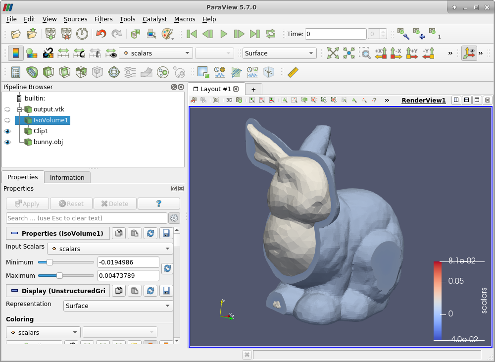

# Signed Distance Field (SDF) library for Python

This library provides a simple interface for computing a SDF given an input list of triangles and list of field points. The library has two important components that needs to be "installed".

1. `libsdf`: This is a shared (dynamic) library that compute the SDF.
2. `pysdf`: This is the python wrapper interfacing `libsdf`.

`pysdf` wrapper:

* Python 3.7
* Cython
* NumPy

## Install and build

Note: when cloning with `git`, make sure you use the `--recursive` flag

### Building `libsdf`:

Dependencies:

* OptiX 7.2 (7.4 crashes)
* Cmake 3.17

Provided are the Linux build instructions. Windows instructions will follow similar steps, however with MSVC providing build support instead of GCC.

```
mkdir build && cd build
cmake ../ -DOptiX_INSTALL_DIR=/path/to/optix7/
make
```
To test the build, you can run the demo application:

```
./demo ../demo/bunny.obj
```

Note: A successful build will provide `libsdf.so`. The library has to be in your library search path (e.g. `LD_LIBRARY_PATH`) for applications that use it.

Implementation detail: The library embeds the created `grid.ptx` file into a source file compiled into `libsdf.so`.

#### Docker

A docker container is provided in `docker/Dockerfile`. To build the container, download the OptiX installer and extract it. The container must be build using that directory as the build context to be able to copy the OptiX library into the container.

To build the library, then go to the `libsdf` source directory and start the container:

```shell
CONTAINER=libsdf:0

cd docker
cp -r /path/to/optix7.2 .
docker build -t $CONTAINER

# To build the library:
docker run -v $(pwd):/libsdf -u $(id -u):$(id -g) $CONTAINER bash -c "cd home && rm -rf build && mkdir build && cd build && cmake .. -DOptiX_INSTALL_DIR=/usr/local/optix -DCMAKE_LIBRARY_PATH=/usr/local/cuda/lib64/stubs -DCMAKE_CUDA_ARCHITECTURES=80 && make -j"

# To run the demo:
docker run --gpus=all -e NVIDIA_DRIVER_CAPABILITIES=all -v $(pwd):/libsdf -u $(id -u):$(id -g) opt:0 bash -c "cd libsdf/build && ./demo ../demo/bunny.obj"
```

### Building `pysdf`

We provide an Anaconda environment to ensure easy installation, however this isn't strictly necessary as the python dependencies are minimal.

```
conda env create -f environment.yml
conda activate sdf_dev
```

The provided `setup.py` packages the library (which uses Cython to access `libsdf`). From within the Anaconda install:

```
python setup.py develop
```

### Running tests

We have a test that additionally shows how to use the library.

```
cd test
export LD_LIBRARY_PATH=../build/
python test_sdf.py
```

# Example

Using the library from python using a simple unit tetrahedra and two points at (1., 1., 1.) and (0.1, 0.1, 0.1).

```python
import numpy as np
import pysdf.sdf as sdf

def test_sdf():
    # unit tetrahedra
    tet = np.array([0, 0, 0, # bottom
                    0, 1, 0,
                    1, 0, 0,
                    0, 0, 0, # front
                    1, 0, 0,
                    0, 0, 1,
                    0, 0, 0, # left
                    0, 0, 1,
                    0, 1, 0,
                    1, 0, 0, # "top"
                    0, 1, 0,
                    0, 0, 1], dtype=np.float64)
                    
    sdf_tet = sdf.signed_distance_field(tet, np.array([1, 1, 1, 0.1, 0.1, 0.1], dtype=np.float64))
    print("results:", sdf_tet)

    (sdf_tet, sdf_hit_pts) = sdf.signed_distance_field(tet, np.array([1, 1, 1, 0.1, 0.1, 0.1], dtype=np.float64), include_hit_points=True)
    print("sdf_hit_pts=", sdf_hit_points)
    
```
This outputs:
```
Debugging output:
...
...
results: [ 1.15470052 -0.1       ]
...
sdf_hit_pts = [0.33333334 0.33333334 0.33333328 0.0 0.10000005 0.1]
```

As one can see, the point outside the tetrahedra yields a positive distance (1.154) and the point inside the tetrahedra yields a negative distance (-0.1).

# Algorithm

There are two parts to a signed distance field:

1. "Signed" part, which I refer to as the inside/outside test.
2. Distance part, which is the distance from the field point to the surface.

`pysdf` computes these in two separate steps.

For both the following steps, the assumed inputs are a collection of points where we evaluate the signed distance and a closed triangular mesh.

## Distance field

Using a CUDA-based tree structure (BVH), we determine the closest triangle to the query point, and refine the distance based on that closest triangle.

## Signed field

In the default case, the signed field is computed from the hit-point of the closet point on a triangle using triangle to query-point normal alignment. Using the internal C++ API, it is possible to use a different technique, including ray-based counting when triangle normals aren't reliable.

# Demo Application

In `demo/main.cpp` is a demo application, which takes in an OBJ and outputs the SDF grid as a `output.vtk` (`demo/bunny.obj` is included). It is built by default with the library.



Usage is:
```
./demo bunny.obj
```

## Preparing lib and demo for distribution:

Using cmake's install and packaging tooling, `make package` will compile the library, demo, and arrange the files into a `libsdf-0.1-Linux.zip`.

```
libsdf-0.1-Linux.zip:

README.md
lib/libsdf.so
include/sdf.h
bin/demo
demo_src/
   main.cpp
   tiny_obj_loader.h
   bunny.obj
```

### Source packaging

```
# install git archive (with submodules) utility
conda activate sdf_dev
pip install git-archive-all

# normally
git-archive-all libsdf.zip

# include git revision with fish shell
git-archive-all libsdf-(git rev-parse --short HEAD).zip

```
